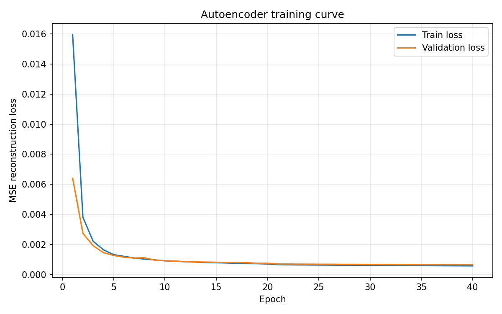
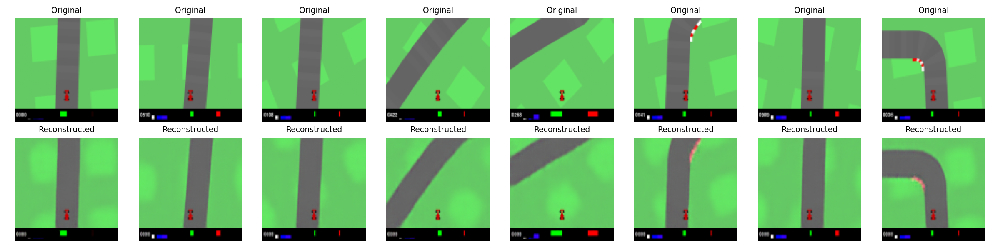
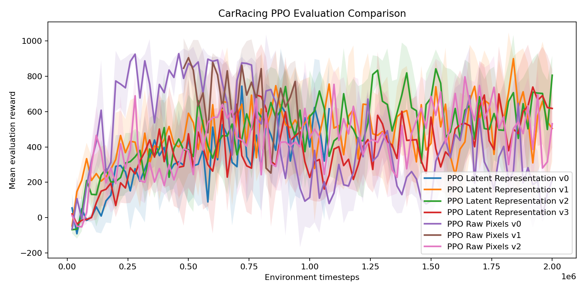
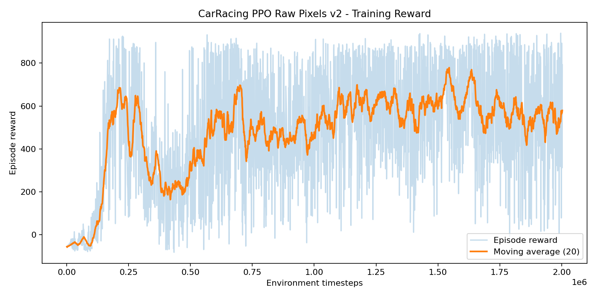
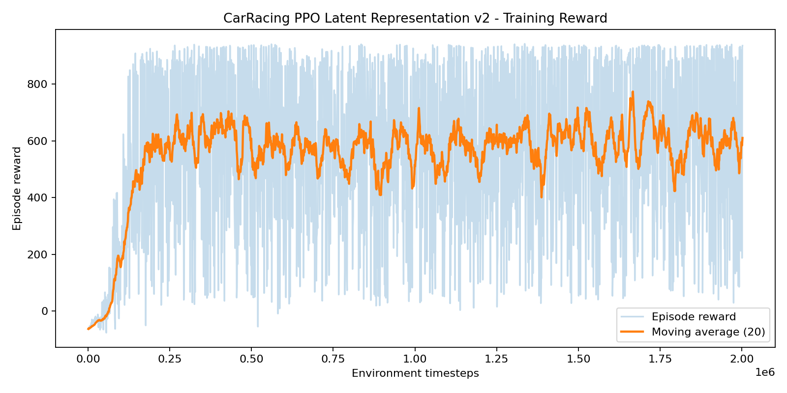

# Autoencoder-Based Latent Representations for Visual Reinforcement Learning in CarRacing-v3

**AI Lab Project Report**

**Author:** Andrea Catino

## Abstract

Visual Reinforcement Learning (Visual RL) studies agents that learn control policies directly from visual observations. This setting is challenging because the agent must learn both useful visual features and a control policy from reward signals, which are often noisy and sparse. This project investigates whether a compact latent representation learned by a convolutional autoencoder can improve the learning behaviour of a PPO agent in the `CarRacing-v3` environment.

The baseline agent is a standard PPO agent trained directly from RGB frames using a CNN policy. The proposed approach first trains a convolutional autoencoder to reconstruct frames collected from the environment, then freezes the encoder and uses it as a visual feature extractor. The PPO agent is then trained on the resulting latent vectors using an MLP policy.

The experiments show that PPO trained from raw pixels can reach high peak performance quickly, but its training behaviour is unstable and can degrade significantly after reaching a good policy. The latent PPO agent does not clearly improve sample efficiency, but some latent runs reach competitive performance and show better final evaluation reward than the raw-pixel baseline trained with the same learning rate. Overall, the results suggest that autoencoder-based latent representations can be useful and competitive, but they are not automatically superior to end-to-end raw-pixel learning.

## 1. Introduction

Reinforcement Learning (RL) algorithms learn by interacting with an environment and optimizing cumulative reward. In classical RL examples, the state is often represented by compact numerical features. In Visual RL, however, the agent receives images as observations. This makes the problem harder because the agent must learn what visual information matters before it can learn how to act.

In this project, the environment is `CarRacing-v3` from Gymnasium. The agent observes RGB frames of size `96 x 96 x 3` and controls a car through continuous actions: steering, throttle, and brake. The main algorithm used for control is Proximal Policy Optimization (PPO), implemented with Stable-Baselines3.

The central research question is:

> Does a latent representation learned by a CNN autoencoder improve sample efficiency, reward stability, or final performance compared to PPO trained directly from raw pixels?

The motivation is that an autoencoder can learn a compact visual representation using a reconstruction objective before the RL training starts. This separates visual representation learning from policy learning. Instead of forcing PPO to learn perception and control jointly from reward, the latent approach gives PPO a lower-dimensional representation of the visual input.

The project is not intended to reach state-of-the-art performance. The goal is to build a simple, reproducible, and explainable experimental pipeline that compares two Visual RL approaches under realistic constraints.

## 2. Background

### 2.1 Visual Reinforcement Learning

In Visual RL, observations are images rather than low-dimensional state vectors. This is common in simulated control, robotics, games, and autonomous driving tasks. Image observations contain rich information but also introduce high dimensionality. For a `96 x 96 x 3` RGB frame, the observation has 27,648 pixel values. A policy trained directly from these pixels must learn features such as road position, car location, track boundaries, and visual context.

This makes training slower and less stable than learning from compact state vectors. A common approach is to use convolutional neural networks (CNNs), which can learn spatial features from images. In Stable-Baselines3, this corresponds to using `CnnPolicy`.

### 2.2 Proximal Policy Optimization

PPO is a policy-gradient algorithm widely used in deep reinforcement learning. Instead of learning a table of action values, PPO directly optimizes a parameterized policy, usually represented by a neural network. PPO collects rollouts from the environment and updates the policy using a clipped objective that limits overly large policy updates.

This clipping mechanism is intended to improve training stability. However, PPO can still be unstable in complex environments such as `CarRacing-v3`, especially when learning directly from images. In this project, PPO is used both for the raw-pixel baseline and for the latent-vector agent.

### 2.3 Autoencoders and Latent Representations

An autoencoder is a neural network trained to reconstruct its input. It consists of:

- an **encoder**, which maps the input image to a compact latent vector;
- a **decoder**, which maps the latent vector back to an image.

In this project, the autoencoder is trained with mean squared error (MSE) reconstruction loss. After training, the decoder is no longer needed for RL. The encoder is frozen and used as a feature extractor:

```text
RGB frame -> encoder -> latent vector -> PPO policy
```

This changes the RL problem from image-based control to vector-based control. Therefore, the latent PPO agent uses `MlpPolicy` instead of `CnnPolicy`.

## 3. Methodology

### 3.1 Environment

The environment used in all experiments is `CarRacing-v3` from Gymnasium.

Main properties:

- observation: RGB image, `96 x 96 x 3`;
- action space: continuous control `[steering, throttle, brake]`;
- algorithm: PPO;
- framework: Stable-Baselines3 and PyTorch;
- environment setting: `domain_randomize=False`;
- `lap_complete_percent=0.95`;
- evaluation uses deterministic actions.

The default RGB frame includes the simulator HUD at the bottom of the image. This means that both the raw-pixel PPO and the latent PPO receive the same original visual observation. This keeps the comparison fair, although it is a limitation because the image contains interface information in addition to the road scene.

### 3.2 Raw-Pixel PPO Baseline

The baseline uses PPO directly on RGB frames:

```text
CarRacing RGB frame -> PPO CnnPolicy -> continuous action
```

Stable-Baselines3 automatically applies the image processing required by `CnnPolicy`, including channel ordering through `VecTransposeImage`. The CNN feature extractor is trained jointly with the policy and value function using the PPO objective.

The raw-pixel baseline is important because it represents the standard end-to-end Visual RL approach: perception and control are learned together from reward.

### 3.3 Frame Collection

Frames were collected from CarRacing during PPO interaction and saved as PNG images. These frames were later used as the unsupervised dataset for training the autoencoder.

The final dataset contains approximately:

```text
18,291 RGB frames
```

Each frame is loaded as an RGB image, converted to `float32`, normalized to `[0, 1]`, and transposed from `H x W x C` to `C x H x W` for PyTorch.

The dataset returns pairs:

```python
(image, image)
```

because the autoencoder target is the original input itself.

### 3.4 Autoencoder Architecture

The convolutional autoencoder receives RGB frames with shape:

```text
3 x 96 x 96
```

The encoder progressively reduces spatial resolution while increasing the number of feature maps:

| Layer | Output Shape |
|---|---|
| Input | `3 x 96 x 96` |
| Conv2d 3 -> 32, stride 2 | `32 x 48 x 48` |
| Conv2d 32 -> 64, stride 2 | `64 x 24 x 24` |
| Conv2d 64 -> 128, stride 2 | `128 x 12 x 12` |
| Conv2d 128 -> 256, stride 2 | `256 x 6 x 6` |
| Flatten | `9216` |
| Linear | `128` |

The latent dimension is:

```text
latent_dim = 128
```

The decoder mirrors the encoder using a linear layer followed by transposed convolutions, reconstructing an output image with shape:

```text
3 x 96 x 96
```

The final decoder activation is a sigmoid, which keeps reconstructed pixel values in `[0, 1]`.

### 3.5 Autoencoder Training

The autoencoder was trained using:

- loss: MSE reconstruction loss;
- optimizer: Adam;
- batch size: 128;
- train/validation split: 90% / 10%;
- total training: 40 epochs;
- initial learning rate: `1e-3`;
- fine-tuning learning rate: `1e-4`;
- device: CUDA GPU.

The first 20 epochs learned the main structure of the images. A second 20-epoch fine-tuning phase with lower learning rate slightly reduced validation loss but did not substantially change the visual sharpness of reconstructions.

The final reconstruction losses were:

```text
train_loss = 0.000581
val_loss   = 0.000659
```

The loss curves show stable convergence and no clear overfitting. Qualitatively, the autoencoder preserves road geometry and car position, but the reconstructions are slightly blurred, especially around road edges. This is expected when using pixel-wise MSE loss, which tends to produce smooth reconstructions.

Autoencoder figures:





### 3.6 Latent PPO

After training the autoencoder, the encoder is frozen and used inside a Gymnasium observation wrapper. The wrapper transforms each RGB observation into a latent vector:

```text
RGB frame 96 x 96 x 3
-> normalize to [0, 1]
-> transpose to 3 x 96 x 96
-> encoder
-> latent vector of size 128
```

The latent observation space is:

```text
Box(low=-inf, high=inf, shape=(128,), dtype=float32)
```

Since the policy no longer receives an image, latent PPO uses:

```python
PPO("MlpPolicy", latent_env)
```

The encoder is used only as a fixed feature extractor:

```python
model.eval()
for param in model.parameters():
    param.requires_grad = False
```

This experiment tests whether a representation learned independently from reward can help PPO learn control more effectively.

## 4. Experiments

The experiments compare two main approaches:

1. **Raw PPO:** PPO trained directly on RGB frames using `CnnPolicy`.
2. **Latent PPO:** PPO trained on frozen autoencoder latent vectors using `MlpPolicy`.

Evaluation was performed every `10,000` timesteps using deterministic policy evaluation over multiple episodes. The main metrics are:

- best mean evaluation reward;
- final mean evaluation reward;
- timestep at which the best evaluation reward was reached;
- reward standard deviation during evaluation;
- training reward curves;
- reward variability.

Multiple runs were performed because PPO on CarRacing is highly stochastic and non-monotonic.

### 4.1 Run Summary

| Run | Type | Learning Rate | Eval Steps | Best Mean Reward | Best Step | Final Mean Reward | Notes |
|---|---|---:|---:|---:|---:|---:|---|
| raw/v0 | Raw pixels, CnnPolicy | `3e-4` | 2,000,000 | **927.78 +/- 5.57** | 460,000 | 213.84 +/- 31.37 | Highest peak, strong final degradation |
| raw/v1 | Raw pixels, CnnPolicy | `1e-4` | 960,000 | 904.87 +/- 44.90 | 500,000 | 429.62 +/- 248.11 | Incomplete / secondary run |
| raw/v2 | Raw pixels, CnnPolicy | `1e-4` | 2,000,000 | 796.82 +/- 98.35 | 1,640,000 | 531.41 +/- 167.75 | Main raw run at `1e-4` |
| latent/v0 | Latent, MlpPolicy | `1e-4` | 1,080,000 | 743.89 +/- 190.66 | 720,000 | 616.04 +/- 261.44 | Interrupted exploratory run |
| latent/v1 | Latent, MlpPolicy | `1e-4` | 2,000,000 | 899.65 +/- 12.79 | 1,840,000 | 504.64 +/- 187.32 | High peak, unstable final |
| latent/v2 | Latent, MlpPolicy | `1e-4` | 2,000,000 | 842.06 +/- 109.64 | 1,520,000 | **805.81 +/- 109.63** | Best final performance |
| latent/v3 | Latent, MlpPolicy | `3e-4` | 2,000,000 | 739.18 +/- 130.22 | 1,920,000 | 617.91 +/- 220.82 | Learning-rate ablation |

### 4.2 Evaluation Curves

The following plot compares deterministic evaluation reward over training:



The evaluation curve shows that `raw/v0` reaches very high performance early, but later collapses. This suggests that raw-pixel PPO can learn a strong policy quickly under some hyperparameters, but the training process is not stable.

The main fair comparison at learning rate `1e-4` is between:

- `raw/v2`;
- `latent/v1`;
- `latent/v2`.

Under this setting, the latent runs are competitive with the raw-pixel baseline. `latent/v1` reaches a higher best reward than `raw/v2`, while `latent/v2` obtains the best final reward among all runs.

### 4.3 Training Reward Behaviour

The raw-pixel training curve for `raw/v2` shows improvement over time, but with high variability:



The latent training curve for `latent/v2` shows a similar high-variance pattern but maintains a stronger final evaluation score:



Both methods show large fluctuations in episode reward, confirming that PPO training in `CarRacing-v3` is unstable. This also motivates using evaluation checkpoints rather than relying only on the final policy.

## 5. Results and Discussion

### 5.1 Sample Efficiency

The raw-pixel PPO run `raw/v0` reaches high reward much earlier than the latent runs. It reaches a best evaluation mean of `927.78` at only `460,000` timesteps. This suggests that raw-pixel PPO with a CNN policy can be very sample efficient in this environment when the learning dynamics are favourable.

However, this result is tied to the higher learning rate `3e-4`, which also appears to contribute to instability. With learning rate `1e-4`, the raw run `raw/v2` reaches its best reward much later, at `1,640,000` timesteps.

The latent runs do not clearly improve sample efficiency. Their best rewards occur relatively late:

- `latent/v1`: best at `1,840,000`;
- `latent/v2`: best at `1,520,000`;
- `latent/v3`: best at `1,920,000`.

Therefore, the experimental evidence does not support the claim that the autoencoder latent representation improves sample efficiency.

### 5.2 Stability

The main positive result for the latent approach is final performance. The raw-pixel run with the highest peak, `raw/v0`, collapses from a best mean reward of `927.78` to a final mean reward of `213.84`. The more conservative raw run `raw/v2` finishes at `531.41`.

By contrast, `latent/v2` finishes at:

```text
805.81 +/- 109.63
```

This is the best final evaluation reward among all runs. This suggests that the frozen latent representation may help maintain a more useful policy later in training, at least in some runs.

However, this result is not fully consistent across all latent runs. `latent/v1` reaches a high best reward but finishes at `504.64`. Therefore, the latent representation does not eliminate PPO instability, but it can produce competitive and sometimes more stable final policies.

### 5.3 Learning Rate Effects

The learning-rate ablation is informative:

- raw PPO with `3e-4` reaches the highest peak but collapses strongly;
- raw PPO with `1e-4` is more conservative and reaches lower peak performance;
- latent PPO with `3e-4` does not outperform latent PPO with `1e-4`.

The latent `3e-4` run (`latent/v3`) reaches only:

```text
best = 739.18
final = 617.91
```

This is worse than both `latent/v1` and `latent/v2`. In this setup, the latent PPO agent appears to benefit more from the lower learning rate `1e-4`.

### 5.4 Autoencoder Quality

The autoencoder successfully reconstructs the global structure of the image. The road shape, car position, grass, and simulator HUD are preserved. However, fine details and road boundaries are slightly blurred.

This is a relevant limitation. The policy trained on latent vectors depends on the information preserved by the encoder. If the autoencoder smooths road boundaries, the latent representation may lose details useful for precise driving. This could partly explain why the latent approach does not clearly improve sample efficiency.

At the same time, the latent representation compresses the original image from 27,648 pixel values to 128 latent dimensions. This is a strong compression, and the fact that PPO can still learn competitive policies from it shows that the encoder captures meaningful visual information.

## 6. Limitations

This project has several limitations.

First, the number of runs is limited. PPO is stochastic, and CarRacing has high variance. More random seeds would be needed to draw statistically strong conclusions.

Second, the default CarRacing RGB observation includes the HUD at the bottom of the frame. Both raw and latent agents receive the same observation, so the comparison is fair, but the setup is not a pure road-scene perception problem.

Third, the autoencoder is trained only with pixel-wise MSE loss. This objective tends to produce blurred reconstructions and may not learn the most useful features for control. A representation that reconstructs pixels well is not necessarily optimal for reinforcement learning.

Fourth, the encoder is frozen during PPO training. This makes the experiment clean and easy to interpret, but it prevents the representation from adapting to the control task.

Fifth, the project evaluates only `CarRacing-v3`. The results may not generalize to other Visual RL environments.

Finally, robustness tests under visual perturbations were not included in the final experiments. Testing noise, blur, brightness changes, or occlusions would be useful future work.

## 7. Conclusion

This project compared PPO trained directly from raw pixels with PPO trained on latent representations produced by a frozen CNN autoencoder in `CarRacing-v3`.

The results show that the autoencoder latent representation is competitive but not clearly superior. Raw-pixel PPO can reach very high performance and can learn faster, especially with the default learning rate. However, raw-pixel training is highly unstable and can degrade substantially after reaching a good policy.

The latent approach does not clearly improve sample efficiency, but it achieves competitive best rewards and, in one full run, the best final evaluation reward. This suggests that autoencoder-based representations may help stabilize final policy performance in some cases, although the evidence is not conclusive.

Overall, the project shows that separating visual representation learning from policy learning is feasible and academically interesting, but a simple frozen MSE autoencoder is not enough to guarantee better Visual RL performance. Better representation objectives, fine-tuning, cropped observations, or robustness evaluation would be natural extensions.

## 8. Future Work

Possible future extensions include:

- removing the CarRacing HUD through a crop wrapper and repeating both raw and latent experiments;
- evaluating robustness under noise, blur, brightness changes, or occlusions;
- fine-tuning the encoder during PPO training;
- comparing different latent dimensions such as 64, 128, and 256;
- training the autoencoder with sharper reconstruction objectives;
- repeating experiments over more random seeds;
- testing the method on another visual-control environment.

## References

- Schulman et al., *Proximal Policy Optimization Algorithms*, 2017.
- Mnih et al., *Human-level control through deep reinforcement learning*, 2015.
- Kingma and Ba, *Adam: A Method for Stochastic Optimization*, 2014.
- Stable-Baselines3 documentation.
- Gymnasium documentation.
- PyTorch documentation.
